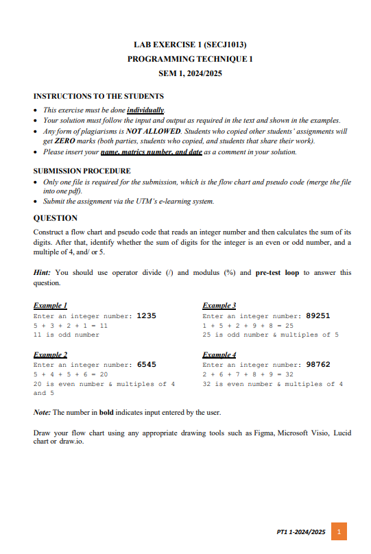

# #️⃣ SECJ 1013 Programming Technique 1
As a fundamental subject, this course equips the students with theory and practice on problem
solving techniques by using the structured approach. Students are required to develop
programs using C++ programming language, in order to solve simple to moderate problems.
The course covers the following: pre-processor directives, constants and variables, data types,
input and output statements, control structures: sequential, selection and loop, built-in and userdefined functions, single and two-dimensional arrays, file operations, pointers, and structured
data types.

## Lab Exercises 
1️⃣ The first lab exercise covered Chapter 1 (flowchart and pseudocode).  
📠Worksheet :   

- 💭 Reflection:
> This lab exercise had evaluated my understanding on flowchart and pseudocode. It also requires us to do extra research regarding the modulus function. (We haven't learn that in this stage 😭😭)
 

2️⃣ The second lab exercise was about writting a C++ program for a calculator.  
📠Worksheet :   

- 💭 Reflection:
> This lab exercise tested our understanding of selection and loops, as we needed to apply these concepts to complete the task. It was also the first coding assignment we had to submit. Writing this C++ program gave me a sense of accomplishment, especially since I had no prior coding experience before university.
 

3️⃣ The third lab exercise requires us to write a C++ program to display the status of Covid-19 cases across states in Malaysia.  
📠Worksheet :   

- 💭 Reflection:
> This lab exercise took the longest time compare to the other two. It requires us to apply what we've learned from chapter 1 (flowchart&pseudocode) to chapter 4 (functions). It was challenging but interesting at the same time. 
 

4️⃣ The fourth lab exercise our lecturer haven't revealed hahaha.  
📠Worksheet :   

- 💭 Reflection:
> Makabaka
 

## Assignments
hhhh

## Assignments

## Reflection
